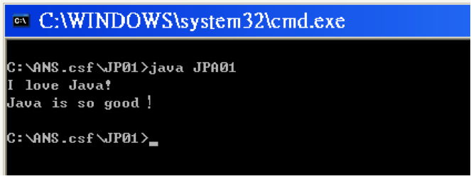

# TQC+ 物件導向程式語言 Java

## 第一類 基本認識

### 101 字串列印

1. 題目說明:

	請開啟檔案JPD01.java，依下列題意完成作答。將JPD01.java內的class JPD01修改為class JPA01，檔案另存成JPA01.java，並編譯為JPA01.class。

2. 設計說明:

	(1) JD01.java所提供的程式有四處錯誤，請修改之 

	(2) 顯示如執行結果參考畫面

3. 執行結果參考畫面:

	

----

### 102 單位換算

2. 設計說明:

	(1) 程式執行時，畫面顯示【Please input:】，於後方由鍵盤輸入數字後，輸出轉換數值(由公斤轉換成磅數)，執行結果顯示如 Screen Dump。

	(2) 單位轉換公式為：1公斤等於2.20462磅。 

	ie:

	Please input: 15

	15.000000 kg = 33.069300 ponds

----

### 103 計算平均值

2. 設計說明:

	(1) 程式執行時，畫面顯示【Please input:】，於下方由鍵盤輸入3個整數，各整數中間以空隔鍵間隔，並分別存入三個整數變數。

	(2) 計算這三個整數的平均值，平均直請取到小數第二位。

	(3) 輸出平均值，顯示如執行結果參考畫面。

----

### 104 距離計算

2. 設計說明:

	(1) Math套件（package）內有許多數學上常用的函數。 

	(2) 請使用 Math.pow 及 Math.sqrt 撰寫程式，顯示【輸入第1組的 x 和 y 座標：】，提示使用者首先輸入第一組座標(x1, y1)，x 與 y 座標的輸入以一空格鍵分隔，其資料型態皆為正整數。 

	(3)  要求輸入第2組座標(x2, y2)。 

	(4)兩組座標輸入完畢，輸出兩組座標之間的距離，顯示如執行結果參考畫面(3)

----

### 105 存錢筒

2. 設計說明:

	(1) 有一位小朋友從小就開始把1元、5元、10元、50元的零用錢，投進自己的存錢筒裡。請計算出存錢筒中金錢的總額。 

	(2) 程式執行時，首先要求輸入姓名，顯示【請輸入您的姓名：】，顯示如 Screen Dump。 

	(3) 姓名輸入完畢，要求輸入銅板個數，顯示如 Screen Dump。 

	(4) 依序要求輸入1元、5元、10元、50元硬幣的數量，待輸入完才可再顯示下一列，顯示如執行結果參考畫面。 

	(5) 金額輸入完畢，輸出總額

----

### 106 數學函數

2. 設計說明:

	(1) 有一數學函數 f(x) = 3(x ^ 3) + 2x - 1。

	(2) 請撰寫一函數 f 用來傳回 f(x) 的值，並分別計算 f(-3.2)、f(-2.1)、f(0)、與 f(2.1)。

	(3) 函數 f(x) 值取到小數第四位。

	(4) 依此數學函數計算，分別輸出此四個計算值，顯示如執行結果參考畫面。

----

### 107 運動成績

2. 設計說明:

	(1) 本題使用其他類別定義的類別方法

	(2) 假設老師在計算運動成績的分數時，動作佔1分，技巧佔2分團隊表現佔3分。 

	(3) basketball 的分數計算方式為：動作 (action) + 技巧 (skill) + 團隊表現 (teamgame)：baseball 的分數計算方式為：10 + 技巧 (skill) + 團隊表現 (teamgame)。 

	(4) 本題內已提供 basketball 與 baseball 兩個類別及成績的計算方式，它們各有一個 calGrade 方法，請將此方法於 basketball 與 baseball 兩個類別中補上。 

	(5) 程式執行時直接計算成績，並輸出 basketball 及 baseball 的成績，顯示如執行結果參考畫面。

----

### 108 覆載方法

2. 設計說明:

	(1) 請在同一個類別中，使用覆載 (OverLoad) 撰寫三個同樣名為 add 的方法。 

	(2) 宣告 main 方法，分別提供以下 a、b、c 等參數。 

	a. add(2, 3);

	b. add(5.2, 4.3);

	c. add("I love", "Java!!");

	(3) 方法一：傳入兩個整數 (int, int)，計算兩整數的和 (int)。程式執行時，列出【Adding two integers: i, j】，請呼叫 main 方法中的 add(2, 3)，將參數代入 i, j 內。

	(4) 方法二：傳入兩個浮點數 (double, double)，計算兩個浮點數的和 (double)，程式執行時，列出【Adding two double: i, j】，請呼叫 main 方法中的 add(5.2, 4.3)，將參數代入 i, j 內。

	(5) 方法三：傳入兩字串 (String, String)，計算合併後的兩個字串 (String)，程式執行時，列出【Adding two string: i, j】，請呼叫 main 方法中的 add("I love", " Java!!")，將參數代入 i, j 內。

	(6) 最後依序顯示此方個方法所計算出的列印值，顯示如執行結果參考畫面。

---

### 109 變數範圍

2. 設計說明:

	(1) 請依照右邊畫面所提供的程式，回傳正確值。

	(2) gameRating 函數需呼叫 adder 方法以取得正確的加總值。

	(3) adder 方法的計算方式為：skill + action + excitement。

	(4) 輸出回傳的正確值，顯示如執行結果參考畫面。

---

### 110 圖形面積

2. 設計說明:

	(1) 請撰寫三個方法計算下面圖形的面積，然後輸出總面積。

	(2) 假設圓的半徑 = 5，PI = 3.1415926，請寫出 calCircle 函數計算圓面積。

	(3) 圓面積計算公式: 半徑平方 * 園周率(PI)。

	(4) 三角形的底 = 10，高 = 5，請寫出 calTriangle 函數計算三角形面積。

	(5) 三角形面積計算公式: 底 * 高 / 2。

	(6) 假設長方形的長 = 5，寬 = 10，請寫出 calRectangle 函數計算方形面積。

	(7) 長方形面積計算公式: 長 * 寬。

	(8) 圖形面積 = 圓面積 + 三角形面積 + 長方形面積。

	(9) 顯示如執行結果參考畫面。

---

## 第二類-條件判斷式

## 第三類-迴圈

## 第四類-遞迴程式設計

### 401 遞回階乘計算

2. 設計說明：

	(1) 請寫一個程式持續輸入一個數 n，使用遞回計算 n 的階乘,直到輸入的數值是999為止。

	(2) 程式執行時，顯示[Input n (0 <= n <= 16):] 要求輸入數值。

	(3) 顯示如執行結果參考畫面。

---

### 402 尾端遞回階乘計算

2. 設計說明：

	(1) 尾端遞回階乘程式的特性是以另外傳入的參數來累計遞回的答案。

	(2) 請寫一個程式持續輸入一個數 n，請分別使用尾端遞回及迴圈，計算 n 的階乘,直到輸入的數值是999為止。

	(3) 程式執行時，顯示[Input n (0 <= n <= 16):] 要求輸入數值。

	(4) 顯示如執行結果參考畫面。

---

### 403 尾端遞回次方計算

2. 設計說明：

	(1) 請寫一個程式持續輸入兩個數 m，n，使用尾端遞回及迴圈計算 m 的 n 次方,直到 m 輸入的數值是999為止。

	(2) 程式執行時，顯示[Input m :] 要求輸入 m ; 輸入完畢，於下行顯示[Input n :] 要求輸入 n。

	(3) 顯示如執行結果參考畫面。

---

### 404 遞回最大公因數

2. 設計說明：

	(1) 請寫一個程式持續輸入兩個數 m，n，使用遞回計算 m 與 n 的最大公因數,直到 m 輸入的數值是999為止。

	(2) 程式執行時，顯示[Input m :] 要求輸入 m ; 輸入完畢，於下行顯示[Input n :] 要求輸入 n。

	(3) 計算最大公因數，顯示如執行結果參考畫面。

---

### 405 遞回函數

2. 設計說明：

	(1) 請利用下面的公式，撰寫遞回函數 sum2 :

	    a. sum(1) = 2

	    b. sum2(n) = sum2(n-1) + 2 * n

	(2) 程式執行時，顯示[Input n :] 要求輸入 n ( n >= 1 )，並將 n 值代入函數中。

	(3) 顯示如執行結果參考畫面。

---

### 406 遞回字串計算

2. 設計說明：

	(1) 請使用遞回撰寫一個方法，可計算一個字串內有幾個A，大小寫有所區別。

	(2) 程式執行時，顯示[Input a string :] 要求輸入字串。

	(3) 連續執行兩次，如執行結果參考畫面，顯示[輸入的字串 has X As]。將計算此字串內有幾個A，帶入X中。

---	

### 407 尾端遞回計算總和

2. 設計說明：

	(1) 請使用尾端遞回及迴圈撰寫一個類別方法，此方法能夠計算一個數字字串內所有數字的和。

	(2) 程式執行時，顯示[Input a string of numbers :] 要求輸入數字字串。

	(3) 連續執行兩次，如執行結果參考畫面，列出以[尾端遞回] 及 [迴圈] 計算後之數字總和。

---

### 408 遞回字串反向

2. 設計說明：

	(1) 請使用尾端遞回及迴圈撰寫一個類別方法，此方法能夠將字串反向。

	(2) 程式執行時，顯示[Input a string :] 要求輸入字串。

	(3) 連續執行兩次，如執行結果參考畫面將字串反向印出。

---

### 409 遞回字串移除

2. 設計說明：

	(1) 請使用尾端遞回及迴圈撰寫一個類別方法，此方法能夠將一個字串內的某字元移除。

	(2) 程式執行時，顯示[Input a string:] 要求輸入數字字串。

	(3) 輸入完畢，顯示 [Input a character:] 要求輸入[欲移除] 的字元。

	(4) 連續執行兩次，顯示如執行結果參考畫面，將字元從字串中移除。

---

### 410 遞回字串替換

2. 設計說明：

	(1) 請使用尾端遞回及迴圈撰寫一個類別方法，此方法能夠將一個字串內的某字元換成另一個字元。例如輸入字串 [windows]，將字串中 w 值 換成 g 值，輸出字串[gindogs]。

	(2) 程式執行時，顯示[Input a string:] 要求輸入數字字串。

	    接續顯示 [Input a character:] 要求輸入[被替換] 的字元。

	    最後顯示 [Input another character:] 要求輸入替換字元。

	(3) 請利用 replace()函數進行字串替換，顯示如執行結果參考畫面。

---
## 第五類-陣列設計能力

## 第六類-物件導向程式設計與例外處理
