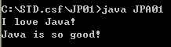
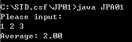

# TQC+ 物件導向程式語言 Java

## 第一類 基本認識

### 101 字串列印

1. 題目說明:

	請開啟檔案JPD01.java，依下列題意完成作答。將JPD01.java內的class JPD01修改為class JPA01，檔案另存成JPA01.java，並編譯為JPA01.class。

2. 設計說明:

	(1) JD01.java所提供的程式有四處錯誤，請修改之 

	(2) 顯示如執行結果參考畫面

3. 執行結果參考畫面:

	

----

### 102 單位換算

1. 題目說明:

	請開啟檔案JPD01.java，依下列題意完成作答。將JPD01.java內的class JPD01修改為class JPA01，檔案另存成JPA01.java，並編譯為JPA01.class。

2. 設計說明:

	(1) 程式執行時，畫面顯示【Please input:】，於後方由鍵盤輸入數字後，輸出轉換數值(由公斤轉換成磅數)，執行結果顯示如 Screen Dump。

	(2) 單位轉換公式為：1公斤等於2.20462磅。 

	ie:

	Please input: 15

	15.000000 kg = 33.069300 ponds

3. 執行結果參考畫面:

	

----

### 103 計算平均值

1. 題目說明:

	請開啟檔案JPD01.java，依下列題意完成作答。將JPD01.java內的class JPD01修改為class JPA01，檔案另存成JPA01.java，並編譯為JPA01.class。

2. 設計說明:

	(1) 程式執行時，畫面顯示【Please input:】，於下方由鍵盤輸入3個整數，各整數中間以空隔鍵間隔，並分別存入三個整數變數。

	(2) 計算這三個整數的平均值，平均直請取到小數第二位。

	(3) 輸出平均值，顯示如執行結果參考畫面。

3. 執行結果參考畫面:

	

----

### 104 距離計算

1. 題目說明:

	請開啟檔案JPD01.java，依下列題意完成作答。將JPD01.java內的class JPD01修改為class JPA01，檔案另存成JPA01.java，並編譯為JPA01.class。

2. 設計說明:

	(1) Math套件（package）內有許多數學上常用的函數。 

	(2) 請使用 Math.pow 及 Math.sqrt 撰寫程式，顯示【輸入第1組的 x 和 y 座標：】，提示使用者首先輸入第一組座標(x1, y1)，x 與 y 座標的輸入以一空格鍵分隔，其資料型態皆為正整數。 

	(3)  要求輸入第2組座標(x2, y2)。 

	(4)兩組座標輸入完畢，輸出兩組座標之間的距離，顯示如執行結果參考畫面(3)

3. 執行結果參考畫面:

	

----

### 105 存錢筒

1. 題目說明:

	請開啟檔案JPD01.java，依下列題意完成作答。將JPD01.java內的class JPD01修改為class JPA01，檔案另存成JPA01.java，並編譯為JPA01.class。

2. 設計說明:

	(1) 有一位小朋友從小就開始把1元、5元、10元、50元的零用錢，投進自己的存錢筒裡。請計算出存錢筒中金錢的總額。 

	(2) 程式執行時，首先要求輸入姓名，顯示【請輸入您的姓名：】，顯示如 Screen Dump。 

	(3) 姓名輸入完畢，要求輸入銅板個數，顯示如 Screen Dump。 

	(4) 依序要求輸入1元、5元、10元、50元硬幣的數量，待輸入完才可再顯示下一列，顯示如執行結果參考畫面。 

	(5) 金額輸入完畢，輸出總額

3. 執行結果參考畫面:

	

----

### 106 數學函數

1. 題目說明:

	請開啟檔案JPD01.java，依下列題意完成作答。將JPD01.java內的class JPD01修改為class JPA01，檔案另存成JPA01.java，並編譯為JPA01.class。

2. 設計說明:

	(1) 有一數學函數 f(x) = 3(x ^ 3) + 2x - 1。

	(2) 請撰寫一函數 f 用來傳回 f(x) 的值，並分別計算 f(-3.2)、f(-2.1)、f(0)、與 f(2.1)。

	(3) 函數 f(x) 值取到小數第四位。

	(4) 依此數學函數計算，分別輸出此四個計算值，顯示如執行結果參考畫面。

3. 執行結果參考畫面:

	

----

### 107 運動成績

1. 題目說明:

	請開啟檔案JPD01.java，依下列題意完成作答。將JPD01.java內的class JPD01修改為class JPA01，檔案另存成JPA01.java，並編譯為JPA01.class。

2. 設計說明:

	(1) 本題使用其他類別定義的類別方法

	(2) 假設老師在計算運動成績的分數時，動作佔1分，技巧佔2分團隊表現佔3分。 

	(3) basketball 的分數計算方式為：動作 (action) + 技巧 (skill) + 團隊表現 (teamgame)：baseball 的分數計算方式為：10 + 技巧 (skill) + 團隊表現 (teamgame)。 

	(4) 本題內已提供 basketball 與 baseball 兩個類別及成績的計算方式，它們各有一個 calGrade 方法，請將此方法於 basketball 與 baseball 兩個類別中補上。 

	(5) 程式執行時直接計算成績，並輸出 basketball 及 baseball 的成績，顯示如執行結果參考畫面。

3. 執行結果參考畫面:

	

----

### 108 覆載方法

1. 題目說明:

	請開啟檔案JPD01.java，依下列題意完成作答。將JPD01.java內的class JPD01修改為class JPA01，檔案另存成JPA01.java，並編譯為JPA01.class。

2. 設計說明:

	(1) 請在同一個類別中，使用覆載 (OverLoad) 撰寫三個同樣名為 add 的方法。 

	(2) 宣告 main 方法，分別提供以下 a、b、c 等參數。 

	a. add(2, 3);

	b. add(5.2, 4.3);

	c. add("I love", "Java!!");

	(3) 方法一：傳入兩個整數 (int, int)，計算兩整數的和 (int)。程式執行時，列出【Adding two integers: i, j】，請呼叫 main 方法中的 add(2, 3)，將參數代入 i, j 內。

	(4) 方法二：傳入兩個浮點數 (double, double)，計算兩個浮點數的和 (double)，程式執行時，列出【Adding two double: i, j】，請呼叫 main 方法中的 add(5.2, 4.3)，將參數代入 i, j 內。

	(5) 方法三：傳入兩字串 (String, String)，計算合併後的兩個字串 (String)，程式執行時，列出【Adding two string: i, j】，請呼叫 main 方法中的 add("I love", " Java!!")，將參數代入 i, j 內。

	(6) 最後依序顯示此方個方法所計算出的列印值，顯示如執行結果參考畫面。

3. 執行結果參考畫面:

	

---

### 109 變數範圍

1. 題目說明:

	請開啟檔案JPD01.java，依下列題意完成作答。將JPD01.java內的class JPD01修改為class JPA01，檔案另存成JPA01.java，並編譯為JPA01.class。

2. 設計說明:

	(1) 請依照JPD01.java所提供的程式，回傳正確值。

	(2) gameRating 函數需呼叫 adder 方法以取得正確的加總值。

	(3) adder 方法的計算方式為：skill + action + excitement。

	(4) 輸出回傳的正確值，顯示如執行結果參考畫面。

3. 執行結果參考畫面:

	

---

### 110 圖形面積

1. 題目說明:

	請開啟檔案JPD01.java，依下列題意完成作答。將JPD01.java內的class JPD01修改為class JPA01，檔案另存成JPA01.java，並編譯為JPA01.class。

2. 設計說明:

	(1) 請撰寫三個方法計算下面圖形的面積，然後輸出總面積。

	(2) 假設圓的半徑 = 5，PI = 3.1415926，請寫出 calCircle 函數計算圓面積。

	(3) 圓面積計算公式: 半徑平方 * 園周率(PI)。

	(4) 三角形的底 = 10，高 = 5，請寫出 calTriangle 函數計算三角形面積。

	(5) 三角形面積計算公式: 底 * 高 / 2。

	(6) 假設長方形的長 = 5，寬 = 10，請寫出 calRectangle 函數計算方形面積。

	(7) 長方形面積計算公式: 長 * 寬。

	(8) 圖形面積 = 圓面積 + 三角形面積 + 長方形面積。

	(9) 顯示如執行結果參考畫面。

3. 執行結果參考畫面:

	

---

## 第二類-條件判斷式

### 201 分數篩選

2. 設計說明:

	(1) 請設計一程式，此程式能判斷輸入分數是否及格，程式執行時，顯示【Please enter score:】要求輸入分數。 

	(2) 如果使用者輸入的分數大於等於60，則輸出【You pass】。

	(3) 如果使用者輸入的分數小於60，則不做任何處理。

	(4) 最後由電腦輸出【End】代表程式結束。

	(5) 重複執行兩次，顯示如執行結果參考畫面。

3. 執行結果參考畫面:

	

---

### 202 比較大小

2. 設計說明:

	(1) 請設計一程式，使用者可輸入兩個整數，並且比較兩個整數大小。

	(2) 程式執行時，畫面顯示【Input:】，請使用者輸入兩組整數，各組整數分別輸入兩組數字，數字中間以空格鍵間隔。

	(3) 重複執行兩次，依輸入的兩個整數比較大小，顯示如執行結果參考畫面。

3. 執行結果參考畫面:

	

---

### 203 判斷奇偶數

2. 設計說明:

	(1) 請設計一程式，使用者可輸入一個整數，判斷此整數為奇數或偶數。

	(2) 程式執行時，畫面顯示【Input an integer:】，請使用者輸入一個整數。

	(3) 重複執行兩次，如執行結果參考畫面。若為奇數，顯示【The number is odd.】；
		若為偶數，顯示【The number is even.】。

3. 執行結果參考畫面:

	

---

### 204 公倍數計算

2. 設計說明:

	(1) 請設計一程式，能判斷使用者所輸入的整數，是否能同時被5、9整除。

	(2) 程式執行時，畫面顯示【Input:】，請使用者輸入一個整數。

	(3) 計算是否能同時被5、9整除。

	(4) 若此數字為5與9的公倍數，則印出【Yes】，否則印出【No】。

	(5) 重複執行兩次，如執行結果參考畫面。

3. 執行結果參考畫面:

	

---

### 205 倍數判斷

2. 設計說明:

	(1) 請設計一程式，能判斷使用者所輸入的整數，是否為2、3、6的倍數。

	(2) 程式執行時，畫面顯示【Input an integer:】，請使用者輸入一個整數。

	(3) 若輸入的整數是2、3、6的倍數，請輸入此整數是2、3、6哪些整數的倍數。若輸入的整數都不是2、3、6的倍數，請輸出【xx 不是2、3、6的倍數】，將使用輸入的整數帶入xx內。

	(4) 重複執行四次，如執行結果參考畫面。

3. 執行結果參考畫面:

	

---

### 206 及格分數

2. 設計說明:

	(1) 請撰寫一個能輸入國文、英文、數學三科分數的程式。

	(2) 程式執行時，如執行結果參考畫面(1)，畫面顯示【Input Chinese score:】，請使用者輸入國文分數，再分別依序要求輸入英文、數學的分數。

	(3) 將此三個分數分別存入變數之中，再判斷是否有任何一科不及格，如果任何一科不及格，則輸出該科不及格，分別顯示【科目+failed.】；如果全部都及格，則輸出全部通過，顯示【All pass.】。

	(4) 重複執行四次，如執行結果參考畫面(2)。

3. 執行結果參考畫面:

	

---

### 207 三角形邊長判斷

2. 設計說明:

	(1) 請撰寫一個判斷三角形的程式：當三個邊長能夠構成三角形時，再判斷該三角形為鈍角、銳角或是直角三角形，
		否則請顯示【不可以構成三角形】。

	(2) 構成三角形存在條件：任兩邊相加大於第三邊，且皆不可為0。

	(3) 直角三角形：其中兩個邊的平方和等於第三邊的平方。

	(4) 鈍角三角形：其中兩個邊的平方和小於第三邊的平方。

	(5) 銳角三角形：任兩個邊的平方和大於第三邊的平方。

	(6) 程式執行時，畫面顯示【請輸入三個整數:】要求三邊的邊長。

	(7) 重複執行四次，顯示如執行結果參考畫面。

3. 執行結果參考畫面:

	

---

### 208 分級制度

2. 設計說明:

	(1) 請寫出一個可以輸入學生分數，並判斷分數等級的程式。

	(2) 當分數>=90分，等級為A，顯示【Your grade is A】。

	(3) 當分數介於90分到80分之間，例如 90分 > 分數 >= 80分，等級為B，顯示【Your grade is B】。

	(4) 當分數介於80分到70分之間，例如 80分 > 分數 >= 70分，等級為C，顯示【Your grade is C】。

	(5) 當分數介於70分到60分之間，例如 70分 > 分數 >= 60分，等級為D，顯示【Your grade is D】。

	(6) 當分數小於60以下，例如60分 > 分數，等級為F，顯示【Your grade is F】。

	(7) 程式執行時，畫面顯示【Input:】，請使用者輸入一個整數。

	(8) 重複執行五次，顯示如執行結果參考畫面。

3. 執行結果參考畫面:

	

---

### 209 象限座標

2. 設計說明:
	
	(1) 請撰寫程式，輸入x、y座標值，判斷該點位於何象限或是在哪個座標軸上。

	(2) 程式執行時，畫面顯示【請輸入x座標：】要求輸入x座標。
		＃舉例：若輸入的座標值為(3.0, -2.5)，輸出【座標值+在第四象限】；
			   若輸入的座標值為(4.5, 0)，輸出【座標值+在x軸上】。

	(3) 重複執行五次，顯示如執行結果參考畫面(2)。

3. 執行結果參考畫面:

	

---

### 210 鍵盤字元判斷

2. 設計說明:
	
	(1) 請使用switch完成編輯區中test()的程式。

	(2) 程式執行時，畫面顯示【Input a character:】，請使用者輸入一個英文字母。

	(3) 若輸入a或b，顯示【You entered a or b】。

	(4) 若輸入x，顯示【You entered x】；若輸入y，顯示【You entered y】。

	(5) 若皆非上述所列英文字母，則顯示【You entered something else.】。

3. 執行結果參考畫面:

	

---

## 第三類-迴圈

### 301 整數連加

1. 題目說明:

	請開啟檔案JPD03.java，依下列題意完成作答。將JPD03.java內的class JPD03修改為class JPA03，檔案另存成JPA03.java，並編譯為JPA03.class。

2. 設計說明:

	(1) 請使用for loop撰寫程式，輸入一個正整數N，計算1+2+3+...+N的結果。

	(2) 程式執行時，顯示【Input:】要求輸入一正整數，輸入完畢，於下方計算1+...+N的總合。

	(3) 顯示如執行結果參考畫面。

----

### 302 巢狀迴圈

1. 題目說明:

	請開啟檔案JPD03.java，依下列題意完成作答。將JPD03.java內的class JPD03修改為class JPA03，檔案另存成JPA03.java，並編譯為JPA03.class。

2. 設計說明:

	(1) 一個外迴圈包住一個或多個內迴圈稱之巢狀迴圈，每次執行外迴圈時，都會進入內迴圈，重複執行。

	(2) 假設外迴圈重複了3次，而內迴圈重複了2次，則內迴圈內的敘述就會執行3*2次。

	(3) 請完成JPD03.java檔案中的程式，讓count之值為27。

	(4) 顯示如執行結果參考畫面。

----

### 303 完美數

1. 題目說明:

	請開啟檔案JPD03.java，依下列題意完成作答。將JPD03.java內的class JPD03修改為class JPA03，檔案另存成JPA03.java，並編譯為JPA03.class。

2. 設計說明:

	(1) 一個術如果恰好等於它的因數（不含數字本身）之和，這個數就稱為「完美數」。

	(2) 例如6=1+2+3，因1、2與3都是6的因數，因而6是完美數。

	(3) 請設計一程式，找出1000以內的所有完美數。

	(4) 顯示如執行結果參考畫面。

----

### 304 餐點費用

1. 題目說明:

	請開啟檔案JPD03.java，依下列題意完成作答。將JPD03.java內的class JPD03修改為class JPA03，檔案另存成JPA03.java，並編譯為JPA03.class。

2. 設計說明:

	(1) 有五位朋友到知名美式餐廳聚餐慶生，此餐廳採點餐的計算方式。

	(2) 程式執行時，如執行結果參考畫面(1)，畫面顯示【Please enter meal dollars or enter -1 to stop:】，請使用者輸入第一道餐點費用，再分別依序要求輸入其他道餐點費用。

	(3) 若要停止執行程式計算，需輸入-1後停止程式計算，-1不列入餐點計算的費用內。如執行結果參考畫面(2)，輸入餐點數量、所有餐點的總費用及平均負擔費用，平均值取自小數第二位。

	(4) 顯示如執行結果參考畫面。

----

### 305 迴圈階乘計算

1. 題目說明:

	請開啟檔案JPD03.java，依下列題意完成作答。將JPD03.java內的class JPD03修改為class JPA03，檔案另存成JPA03.java，並編譯為JPA03.class。

2. 設計說明:

	(1) 請設計一程式計算n的階乘。

	(2) n為使用者任意輸入的整數值，n值的範圍介於1到10之間

	(3) 程式執行時，畫面顯示【Please enter one value:】，首先判斷n值是否介於1到10之間，若檢核通過，則輸出階乘計算後之數值；若沒有介於1至10之間，則顯示【Error, the value is out of range.】。

	(4) 重複執行三次，顯示如執行結果參考畫面。

----

### 306 迴圈次方計算

1. 題目說明:

	請開啟檔案JPD03.java，依下列題意完成作答。將JPD03.java內的class JPD03修改為class JPA03，檔案另存成JPA03.java，並編譯為JPA03.class。

2. 設計說明:

	(1) 請設計一程式，持續輸入兩個數m、n，m與n中間以空隔鍵分隔，並以一個類別方法及while loop計算m的n次方，直到輸入m=999為止。

	(2) 顯示如執行結果參考畫面。

----

### 307 迴圈最大公因數

1. 題目說明:

	請開啟檔案JPD03.java，依下列題意完成作答。將JPD03.java內的class JPD03修改為class JPA03，檔案另存成JPA03.java，並編譯為JPA03.class。

2. 設計說明:

	(1) 請設計一程式，持續輸入兩個數m、n，m與n中間以斷行分隔，並以一個類別方法及while loop計算m與n的最大公因數，直到輸入m=999為止。

	(2) 持續輸入兩個數m、n，顯示如執行結果參考畫面，於下方輸出此兩數的最大公因數。

----

### 308 電腦週邊費用總計

1. 題目說明:

	請開啟檔案JPD03.java，依下列題意完成作答。將JPD03.java內的class JPD03修改為class JPA03，檔案另存成JPA03.java，並編譯為JPA03.class。

2. 設計說明:

	(1) David到某商場為公司購買一系列的電腦週邊設備，請以do-while，計算此次購買的總費用，使「電腦週邊費用總計」程式正常執行。

	(2) do-while的最大特點為：其內的statement至少會被執行一次。do-while的語法如下：
		01	do {
		02		statement;
		03		...
		04	} while (exp)

	(3) 程式執行時，如執行結果參考畫面(1)，畫面顯示【請輸入消費金額，或輸入-1結束：】，請使用者輸入第一項消費金額，再分別依序要求輸入費用，最後輸入-1。

	(4) 當使用者輸入-1，即停止執行程式計算，並如執行結果參考畫面(2)，輸出電腦週邊總消費的總合。

----

### 309 迴圈倍數判斷

1. 題目說明:

	請開啟檔案JPD03.java，依下列題意完成作答。將JPD03.java內的class JPD03修改為class JPA03，檔案另存成JPA03.java，並編譯為JPA03.class。

2. 設計說明:

	(1) 如下為continue之範例寫法。
		01 class Ex {
		02 		public static void main(String argv[]) throws IOExection {
		03 			for (int i=0; i<4; i++) {
		04				if (i==2) {
		05				continue;
		06 				}
		07 				System.out.println("i= " + i);
		08 			}
		09 		}
		10 }
		Output:
		01 i=0
		02 i=1
		03 i=3

	(2) 請用continue設計一個程式，能夠計算1到「使用者輸入的數」之中，哪些數是3的倍數或5的倍數，而不是7的倍數。

	(3) 將這些數值相加後輸出，顯示如執行結果參考畫面。

----

### 310 迴圈正偶數相加

1. 題目說明:

	請開啟檔案JPD03.java，依下列題意完成作答。將JPD03.java內的class JPD03修改為class JPA03，檔案另存成JPA03.java，並編譯為JPA03.class。

2. 設計說明:

	(1) 程式執行時，畫面顯示【請輸入n的值(n > 0，且為偶數):】，請使用者輸入一個正偶數。

	(2) 試利用do-while，計算2+4+6+...+n的總和，其中n為一由鍵盤輸入的正偶數，若輸入的不是正偶數，則程式會要求使用者再次輸入，直到輸入的數是正偶數為止。

	(3) 計算2+4+6+...+n的總和，顯示如執行結果參考畫面(2)。

## 第四類-遞迴程式設計

### 401 遞回階乘計算

2. 設計說明：

	(1) 請寫一個程式持續輸入一個數 n，使用遞回計算 n 的階乘,直到輸入的數值是999為止。

	(2) 程式執行時，顯示[Input n (0 <= n <= 16):] 要求輸入數值。

	(3) 顯示如執行結果參考畫面。

---

### 402 尾端遞回階乘計算

2. 設計說明：

	(1) 尾端遞回階乘程式的特性是以另外傳入的參數來累計遞回的答案。

	(2) 請寫一個程式持續輸入一個數 n，請分別使用尾端遞回及迴圈，計算 n 的階乘,直到輸入的數值是999為止。

	(3) 程式執行時，顯示[Input n (0 <= n <= 16):] 要求輸入數值。

	(4) 顯示如執行結果參考畫面。

---

### 403 尾端遞回次方計算

2. 設計說明：

	(1) 請寫一個程式持續輸入兩個數 m，n，使用尾端遞回及迴圈計算 m 的 n 次方,直到 m 輸入的數值是999為止。

	(2) 程式執行時，顯示[Input m :] 要求輸入 m ; 輸入完畢，於下行顯示[Input n :] 要求輸入 n。

	(3) 顯示如執行結果參考畫面。

---

### 404 遞回最大公因數

2. 設計說明：

	(1) 請寫一個程式持續輸入兩個數 m，n，使用遞回計算 m 與 n 的最大公因數,直到 m 輸入的數值是999為止。

	(2) 程式執行時，顯示[Input m :] 要求輸入 m ; 輸入完畢，於下行顯示[Input n :] 要求輸入 n。

	(3) 計算最大公因數，顯示如執行結果參考畫面。

---

### 405 遞回函數

2. 設計說明：

	(1) 請利用下面的公式，撰寫遞回函數 sum2 :

	    a. sum(1) = 2

	    b. sum2(n) = sum2(n-1) + 2 * n

	(2) 程式執行時，顯示[Input n :] 要求輸入 n ( n >= 1 )，並將 n 值代入函數中。

	(3) 顯示如執行結果參考畫面。

---

### 406 遞回字串計算

2. 設計說明：

	(1) 請使用遞回撰寫一個方法，可計算一個字串內有幾個A，大小寫有所區別。

	(2) 程式執行時，顯示[Input a string :] 要求輸入字串。

	(3) 連續執行兩次，如執行結果參考畫面，顯示[輸入的字串 has X As]。將計算此字串內有幾個A，帶入X中。

---	

### 407 尾端遞回計算總和

2. 設計說明：

	(1) 請使用尾端遞回及迴圈撰寫一個類別方法，此方法能夠計算一個數字字串內所有數字的和。

	(2) 程式執行時，顯示[Input a string of numbers :] 要求輸入數字字串。

	(3) 連續執行兩次，如執行結果參考畫面，列出以[尾端遞回] 及 [迴圈] 計算後之數字總和。

---

### 408 遞回字串反向

2. 設計說明：

	(1) 請使用尾端遞回及迴圈撰寫一個類別方法，此方法能夠將字串反向。

	(2) 程式執行時，顯示[Input a string :] 要求輸入字串。

	(3) 連續執行兩次，如執行結果參考畫面將字串反向印出。

---

### 409 遞回字串移除

2. 設計說明：

	(1) 請使用尾端遞回及迴圈撰寫一個類別方法，此方法能夠將一個字串內的某字元移除。

	(2) 程式執行時，顯示[Input a string:] 要求輸入數字字串。

	(3) 輸入完畢，顯示 [Input a character:] 要求輸入[欲移除] 的字元。

	(4) 連續執行兩次，顯示如執行結果參考畫面，將字元從字串中移除。

---

### 410 遞回字串替換

2. 設計說明：

	(1) 請使用尾端遞回及迴圈撰寫一個類別方法，此方法能夠將一個字串內的某字元換成另一個字元。例如輸入字串 [windows]，將字串中 w 值 換成 g 值，輸出字串[gindogs]。

	(2) 程式執行時，顯示[Input a string:] 要求輸入數字字串。

	    接續顯示 [Input a character:] 要求輸入[被替換] 的字元。

	    最後顯示 [Input another character:] 要求輸入替換字元。

	(3) 請利用 replace()函數進行字串替換，顯示如執行結果參考畫面。

---
## 第五類-陣列設計能力

### 501 陣列計算

1. 題目說明
	
	請開啟檔案 JPD05.java，依下列題意完成作答，將JPD05.java內的class JPD05修改為class JPA05，檔案另存成JPA05.java，並編譯為JPA05.class

2. 設計說明
	
	(1) 請撰寫一個程式，由鍵盤輸入10個整數，並存放到一陣列。

	(2) 程式執行時，顯示如執行結果參考畫面，顯示【請輸入10個整數: 】並顯示【第1個整數: 】，要求輸入第一個整數

	(3) 依序要求輸入第1個至第10個整數，顯示如執行結果參考畫面

	(4) 判斷輸入10個整數後，計算陣列中大於60有幾個，這些大於60的數值總和與平均值，顯示如執行結果參考畫面。

----

### 502 浮點數計算

2. 設計說明
	
	(1) 請撰寫一個程式，由鍵盤輸入學生的人數，根據所輸入的學生人數，動態產生一個符合大小的浮點數陣列。

	(2) 將所輸入的每位學生成績存放到陣列裡(不限制輸入的小數點位數)。

	(3) 程式執行時，顯示【請輸入學生人數: 】，要求輸入學生人數。

	(4) 接續要求輸入第1個至第n個學生的成績，n是剛才輸入的學生人數。

	(5) 計算出人數、總分及平均值(不限制小數點位數)，顯示如執行結果參考畫面。

------

### 503 矩陣之和

2. 設計說明

	(1) 試撰寫一個函數，此函數可用來計算矩陣A與B的和，使「矩陣之和」程式正常執行。
		intA[][]={(1, 2, 3), (4, 5, 6)}
		intA[][]={(7, 8, 9), (10, 11, 12)}

	(2) 計算矩陣A與B的和，並把相加後的結果放在矩陣C裡。

	(3) 顯示執行結果如參考畫面。

----

### 504 費氏數

2. 設計說明

	(1) 費氏數(Fibonacci sequence)可使用於建築設計，費氏數列為0, 1, 1, 2, 3, 5, 8, 13, 21, 34, 55, ...，第一個數為0，第二個數為1，其他的數為前面兩個數之和。

	(2) 請用陣列方式寫出費氏數0, 1, 1, 2, 3, 5, 8, 13, 21, 34的程式。

	(3) 請事先宣告一個大小為10的整數陣列，將最前面兩個陣列指定為費氏數的初始值，並利用初始值來計算其餘的費氏數

	(4) 以分行方式，顯示此費氏數的前10個數值。

------

### 505 反轉陣列

2. 設計說明

	(1) 程式內有一陣列{"A", "B", "C", "D", "E", "F", "G", "H", "I", "J"}。

	(2) 請用陣列方式寫出反轉陣列的程式，顯示{"J", "I", "H", "G", "F", "E", "D", "C", "B", "A"}

	(3) 顯示執行結果如參考畫面。

----

### 506 三圍陣列元素之和 

2. 設計說明

	(1) 設陣列A的維度為4*2*3，是試在程式碼裡宣告此一陣列，並在宣告同時設定初值，然後計算陣列A內的所有元素總和(SUM)。

		intA[4][2][3]={{1, 2, 3}, {4, 5, 6}},
					  {{7, 8, 9}, {10, 11, 12}}
					  {{13, 14, 15}, {16, 17, 18}}
					  {{19, 20, 21}, {22, 23, 24}}

-------

### 507 停車費用計算

2. 設計說明

	(1) 請用陣列方式寫出停車費用計算的程式

	(2) 假設停車時段分為:

		a. 2小時以內(含兩小時)，每小時以30元計算。 

		b. 2小時以上不足4小時，每小時以50元計算。

		c. 4小時以上不足6小時，每小時以80元計算。

		d. 6小時以上，每小時以100元計算。

	(3) 請輸入停車時數並計算出停車費用，分別計算2小時、3小時、5小時及8小時的應繳費用，顯示如結果參考畫面。

-----

### 508 泡泡排序法

2. 設計說明

	(1) 請使用泡泡排序法(Bubble Sort)撰寫程式。

	(2) 程式內有一資料陣列{2, 4, 3, 5, 7, 6, 9, 1}。

	(3) 請輸入泡泡排序法的比對過程。

	(4) 顯示如執行結果參考畫面。

------

### 509 選擇排序法

2. 設計說明

	(1) 請使用選擇排序法(Selection Sort)撰寫程式。

	(2) 程式內有一資料陣列{1, 3, 2, 5, 4, 6} 

	(3) 請輸入選擇排序法的比對過程。

	(4) 顯示如執行結果參考畫面。

--------

### 510 二分搜尋法

2. 設計說明

	(1) 程式內有已排序資料{5, 9, 13, 15, 17, 19, 25, 30, 45}，請使用二分搜尋法尋找輸入的資料。

	(2) 程式連續執行二次，於程式執行時，如執行結果參考畫面所示，顯示【請輸入要找尋的資料: 】，要求輸入欲尋找的資料n。

	(3) 若沒有搜尋到相符數值，顯示【n不在陣列中】，將欲尋找的資料代入n，如執行結果參考畫面。

	(4) 尋找時，列出尋找區間及此區間的中間值，搜尋幾次就列出幾項，最後產出【經過y次的尋找】，y代入搜尋次數；若有搜尋到相符的數值，請顯示【您要找的資料在陣列中的第x個位置】，x代入輸入值，此數值位在陣列中的第幾個位置，如執行結果參考畫面所示。

## 第六類-物件導向程式設計與例外處理

### 601 汽車零件設計

#### 題目一

2. 設計說明

	(1). 請寫一個 Engine(引擊) 類別。1600cc引擎的成本是20000元, 2000cc引擎的成本是25000元。請製造一個1600CC的引擎及一個2000cc的引擎呼叫其getCost(成本)方法，印出其傳回值。

	(2). 請寫一個 Aircond(空調) 類別。Auto空調的成本是12000元， Manual空調的成本是10000元。請製造一個Auto的空調及一個 Manual的空調，呼叫其getCost(成本)方法，印出其傳回值。

	(3). 請撰寫一個Sound(音響) 類別。一個音響的成本是2000元，請製造一個Sound物件、呼叫其getCost(成本)方法，印出其傳回值。

#### 題目二

2. 設計說明

	(1). 這家汽車工廠生產 BasicCar(基本型)及 LuxCar(豪華型) 兩種汽車

	(2). 基本型的成本是：1600cc引擎成本 ＋ Mauual空調成本 + 5000元。

	(3). 豪華型的成本是：2000cc引擎成本 ＋ Auto空調成本 + 10000元。

	(4). 這兩型的售價都是成本的1.2倍。

	(5). 分別計算兩款車子的 cost(成本)與 price(售價)，顯示如執行結果參考畫面。

#### 題目三

2. 設計說明

	(1). SLiuxCar(超級豪華型車款)的成本 = 豪華車款的成本 + 音響成本。

	(2). 這型車的售價也是成本的1.2倍。請為這型車設計一個 SLuxCar 類別。並計算超級豪華型的成本與售價。

	(3). 也請為這家工廠增加一個能夠比較兩部車子的售價何者較貴的方法，此方法能夠比較 SLuxCar(超級豪華型車款) 是否比 LuxCar (豪華型車款) 的售價較貴。

	(4). 顯示如執行結果參考畫面。

#### 題目四

2. 設計說明

	(1). 請建立一個 Warehouse(倉庫) 類別，讀取 data.txt 內三台車子的資料， 每一行即代表一台車，將此三台車放入此倉庫中。 

	(2). data.txt 內有三筆資料，分別是代表 B (Basic 基本款)、L (LuxCar 豪華 型車款)、S (SLuxCar 超級豪華型車款) 的成本，超級豪華車款的成本需再加 上音響成本，內容如下： 

	| 車款 | 引擎 (cc) | 空調   |
	|-----|----------|--------|
	| B   | 1600     | Manual |
	| L   | 2000     | Auto   |
	| S   | 2000     | Auto   |

	(3). 一個倉庫物件內有一個 ArrayList 物件，這個 ArrayList 可以儲存車子。 

	(4). 請計算這個倉庫內，此三台車的總庫存成本及總售價 (成本的 1.2倍)， 顯示如Screen Dump參考畫面。 

	(5). 若找不到data.txt 檔案，則顯示【File not found!】。

#### 題目五

2. 設計說明

	(1). 請建立一個 Warehouse(倉庫) 類別，讀取 data.txt 內三台車子的資料， 每一行即代表一台車，將此三台車放入此倉庫中。 

	(2). data.txt 內有四筆資料，分別是代表 B (Basic 基本款)、L (LuxCar 豪 華型車款)、S (SLuxCar 超級豪華型車款) 的成本，超級豪華車款的成本需 再加上音響成本，最後一筆為不正確的資料 (沒有 X 款的車型)，內容如下：

	| 車款 | 引擎 (cc) | 空調   |
	|-----|----------|--------|
	| B   | 1600     | Manual |
	| L   | 2000     | Auto   |
	| S   | 2000     | Auto   |
	| X   | 2000     | Manual |

	(3). 一個倉庫物件內有一個 ArrayList 物件，這個 ArrayList 可以儲存車子。 

	(4). data.txt有不正確的資料(沒有 X 款的車型)，請使用自定例外類別處理，將不 正確的資料印出。並計算這個倉庫內的總庫存成本及總售價 (成本的 1.2倍)， 顯示如Screen Dump參考畫面。 

	(5). 若找不到data.txt 檔案，則顯示【File not found!】。 

### 602 電腦零件設計

#### 題目一

2. 設計說明

	(1). 請撰寫一個 LCD 類別。10吋的成本是2000元，15吋的成本 是2500元，17吋的成本是3000元。 

	(2). 請撰寫一個 CPU 類別。速度1.66的成本是6000元， 速度2.2的成本是8000元，速度2.4的成本是11000元。 

	(3). 請撰寫一個HD類別。120G的成本是2400元，160G的成本 是2800元。 

	(4). 請使用以上的零件，撰寫以下的類別。

	(5). 請寫一個MiniNote類別。一個MiniNote類別的筆電 有一個10吋的LCD，一個速度1.66的CPU及一個120G的HD。 

	(6). 請寫一個Note15類別。一個Note15類別的筆電有一個 15吋的LCD，一個速度2.2的CPU及一個160G的HD。 

	(7). 這兩型電腦的成本是其零件成本的1.4倍。定價則是 其零件成本的2倍。 

	(8). 請分別製造一個MinitNote及一個Note15, 呼叫其getCost方法及getPrice方法，印出其成本及定價的傳回值。 

#### 題目二

2. 設計說明

	(1). 請寫一個PC類別，一個PC類別的桌上型電腦有一個速度2.4的CPU 及一個160G的HD。製造一個PC類別的桌上型電腦的成本是「零件成本」 加500，售價則為「零件成本」的1.8倍。 

	(2). 另請寫一個MultiPC類別，一個MultiPC的超級電腦，可以有多顆 2.4G的CPU及多顆160G的HD。 MultiPC的成本為其「零件成本」 的1.2倍，售價則為「零件成本」的1.8倍。 

	(3). 請製造一個PC類別的桌上型電腦，一個2顆CPU及4顆HD的MultiPC 及一個4顆CPU及8顆HD的MultiPC. 

	(4). 分別呼叫其getCost方法及getPrice方法，印出其傳回值。 

#### 題目三

2. 設計說明

	(1). 請比較一個Note15的筆電和一個PC類別的桌上型電腦何者較貴。

	(2). 請新增一個名為 AllPC 的類別，於此類別中撰寫isExpensive方法， 此方法能夠比較何者的售價較貴，isExpensive傳回一個布林值。 顯示如執行結果。

#### 題目四

2. 設計說明

	(1). 請使用LinkedList為這家工廠寫一個Order類別。 

	(2). 某筆訂單的資料如下：

		MiniNote 1台

		Note15 1台

		PC 1台 

	(3). 請寫一revenue方法，輸出賣出這些電腦的總收入。 

#### 題目五

2. 設計說明

	(1). 此筆訂單資料如下：

		MiniNote 1台

		Note15 1台

		PC 1台

	(2). 利潤 ＝ 總收入 - 總成本（非零件總成本）

	(3). 如果此次累積利潤超過20000，則印出信息【This odrfer exceeds 2000:x x】，將收入淨額代入 x x。

### 603 冰品計價系統

#### 題目一

2. 設計說明

	(1) 請為冰品的每個原料Apple(蘋果)、Banana(香蕉)、Pudding(布丁)、Strawberry(草莓)、Mango(芒果)、設計類別及繼承的架構，並
	    提供getCost(成本)及getPrice(售價)二個方法。

	(2) 每種類原料的成本與售價如下表：
	    | class name | cost  | price |
	    | (類別名稱)   | (成本)| (售價) |
	    |------------|-------|-------|
	    | Apple      | 6.0   | 10.0  |
	    | Banana     | 2.0   | 5.0   |
	    | Pudding    | 3.0   | 5.0   |
	    | Strawberry | 1.0   | 5.0   |
	    | Mango      | 2.0   | 5.0   |

	(3) 請各產生一個Apple、Banana、Pudding之物件，並印出它們的cost及price。

#### 題目二

2. 設計說明

	(1) 該冰店提供A與B兩類套餐產品。

	(2) A套餐可任點兩種原料，B套餐可任點三種原料。

	(3) 每種類原料的成本與售價如下表：
	    | class name | cost  | price |
	    | (類別名稱)   | (成本)| (售價) |
	    |------------|-------|-------|
	    | Apple      | 6.0   | 10.0  |
	    | Banana     | 2.0   | 5.0   |
	    | Pudding    | 3.0   | 5.0   |
	    | Strawberry | 1.0   | 5.0   |
	    | Mango      | 2.0   | 5.0   |

	(4) 某客人點了以下的產品，請利用getPrice(價格)函式取得price，利用getProfit(利潤)取得profit，並印出以下三種產品的price
	    及profit。
	    利潤 = 總收入 - 總成本
	    a. A t1 = new Two(new Apple(), new Banana());
	    b. B t2 = new Three(new Banana(), new Pudding(), new Strawberry());
	    c. C t3 = new Three(ew Apple(), new Banana(), new Mango());

#### 題目三

2. 設計說明

	(1) 該冰店另提供C套餐與D套餐兩類產品。C套餐可任點兩種原料，冰的份量加倍；D套餐可任點三種原料，冰的份量加倍。

	(2) 每種類原料的成本與售價如下表：
	    | class name | cost  | price |
	    | (類別名稱)   | (成本)| (售價) |
	    |------------|-------|-------|
	    | Apple      | 6.0   | 10.0  |
	    | Banana     | 2.0   | 5.0   |
	    | Pudding    | 3.0   | 5.0   |
	    | Strawberry | 1.0   | 5.0   |
	    | Mango      | 2.0   | 5.0   |

	(3) C套餐與D套餐的冰加倍，成本一律增加2元，銷售的價格則訂為「原料總售價」的1.5倍。
        # 例如 : C套餐選擇Apple及Mango，成本為6.0 + 2.0 + 2 = 10 元
                售價為(10.0 + 5.0) * 1.5 = 22.5 元

    (4) 某客人點了以下的產品，請取得下列三種冰加倍的產品，分別印出其cost(成本)、price(價格)及profit(利潤)。利潤 = 總收入 - 總成本。
        a. C t1 = new DoubleTwo(new Apple(), new Banana());
	    b. D t2 = new DoubleThree(new Banana(), new Pudding(), new Strawberry());
	    c. D t3 = new DoubleThree(ew Apple(), new Banana(), new Mango());

#### 題目四

2. 設計說明

	(1) 請使用LinkedList，另外寫一個類別支援該店的外送服務。

	(2) 外送服務可以計算一次外送服務的總售價、總成本及總利潤。

	(3) 請為以下兩次的外送，分別計算其總售價、總成本及總利潤。
	    a. 外送 1 (冰品皆為一般，無加倍)
	       a-1 : Apple、Banana
	       a-2 : Banana、Pudding、Strawberry
	    b. 外送 2 (冰品皆為一般，無加倍)
	       b-1 : Apple、Banana、Mango
	       b-2 : Apple、Banana
	       b-3 : Banana、Pudding、Strawberry
	       b-4 : Apple、Banana、Mango

#### 題目五

2. 設計說明

	(1) 請使用LinkedList，另外寫一個類別支援該店的外送服務。

	(2) 外送服務可以計算一次外送服務的總售價、總成本及總利潤。

	(3) 請為以下兩次的外送，分別計算其總售價、總成本及總利潤。
	    a. 外送 1 (冰品皆為一般，無加倍)
	       a-1 : Apple、Banana
	       a-2 : Banana、Pudding、Strawberry
	       a-3 : Banana、Pudding、Strawberry
	       a-4 : Apple、Banana、Mango
	    b. 外送 2 (冰品皆為一般，無加倍)
	       b-1 : Apple、Banana、Mango
	       b-2 : Apple、Banana
	(4) 請使用自定例外類別處理，將總額不到50元的外送，以Exception印出錯誤信息【Not enough order for carry out:】
	    及目前的外送金額。

### 604 銀行理財帳戶

#### 題目一

2. 設計說明

	(1) 銀行共設有四種帳戶，分別是「定期存款」帳戶、「活期存款」帳戶、「優惠存款」帳戶及「基金存款」帳戶。前三種帳戶都有開戶人、
	    年利率及帳戶餘額的資料。

	(2) 每個帳戶都可以存款(deposit)、提款(withdraw)、查詢餘額(balance)、加計利息(addInterest)。

	(3) 定期存款帳戶(DepositAccount)的年利率1、2、3年期，各為3%、4%、5%。

	(4) 活期存款帳戶(FreeAccount)的年利率為2%。

	(5) 優惠存款帳戶(SpecialAccount)的利率與活期存款同為2%，但優惠存款帳戶餘額保持在10000元以上則買賣基金可免手續費(傳回
	    布林值代表可/不可)。

	(6) 基金存款帳戶(FundAccount)的必要資料有 : 開戶人、基金名稱、單位數、一個活期存款戶、一個優惠存款戶。買入的手續費為買入金額的2%，
        賣出的手續費為賣出金額的2%。基金存款帳戶可以買、賣、查詢餘額，這幾個功能均須傳入基金目前的價格。買賣基金由活期存款帳戶轉帳。

    (7) 請先為Peter開設一個定期存款帳戶(2年期，存入5000元)、活期存款帳戶(存入20000元)、優惠存款帳戶(存入10000元)。並加總一年的利息後，
        再查詢各帳戶的餘額，依序列出「定期存款」、「活期存款」、「優惠存款」目前的餘額。

    (8) 接著再為Peter新開設一個基金存款帳戶，並買入A基金15000元，價格為每單位500元。於三天後該基金跌價為每單位300元，請計算目前基金的
    	現額，及Peter活期存款帳戶的餘額，請接續2.(7)列出「基金現額」以及「活期餘額」。

#### 題目二

2. 設計說明

	(1) Peter由優惠存款帳戶提款5000元。並再次購買A基金2000元，價格為每單位300元。

	(2) 請列出該【基金餘額】，以及Peter活期存款帳戶【售出前活期餘額】。

	(3) 接著Peter將其基金全數賣出，賣價為每單位400元。

	(4) 請再次查詢Peter之活期存款帳戶餘額。

#### 題目三

2. 設計說明

	(1) 該銀行為服務客戶增設網路銀行帳戶，網路銀行帳戶含有某客戶之所有帳戶的資料。

	(2) 請為Peter開立一個網路銀行帳戶，並撰寫能夠計算Peter所有存款帳戶(不含基金)的總餘額的方法。

#### 題目四

2. 設計說明

	(1) Peter決定買入B基金2000元，買價每單位50元；C基金5000元，買價每單位30元。

	(2) 請查詢Peter之活期存款帳戶的餘額及A、B、C三個基金的單位數。

	(3) B基金的價格現在漲到100元，Peter想要查詢B基金的餘額。請使用HashMap為Peter建立MultiFund(多筆基金)類別，
		HashMap的key值為基金名稱(String)，value值為FundAccount，使其代入B基金後，可輸出目前B基金的金額。

#### 題目五

2. 設計說明

	(1) 請使用Exception撰寫一個功能：當任何一個帳戶之餘額低於0時，不可提款，且印出警告信息。

	(2) Peter再次購買A基金14000元，價格為每單位300元。
	